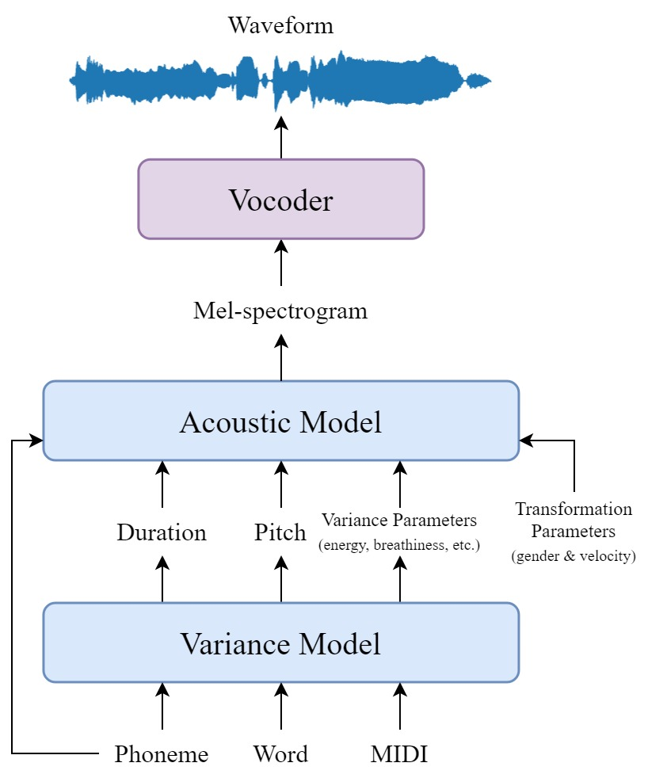
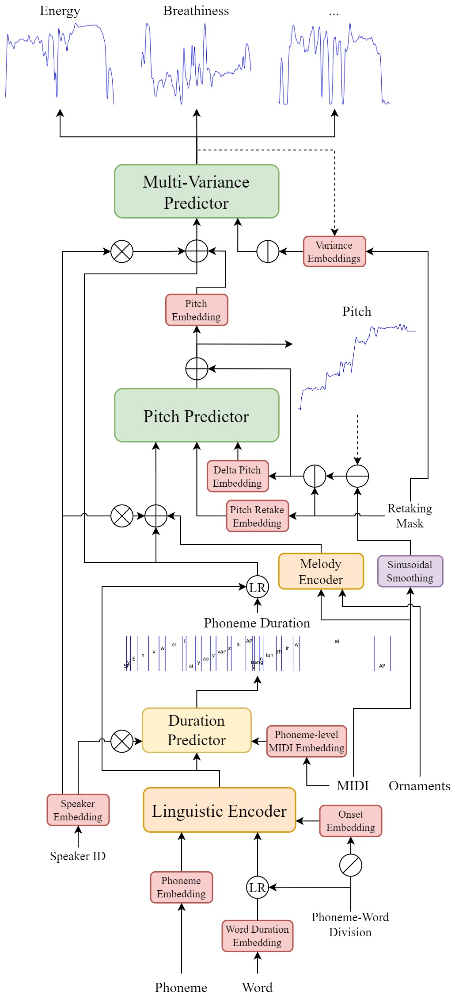
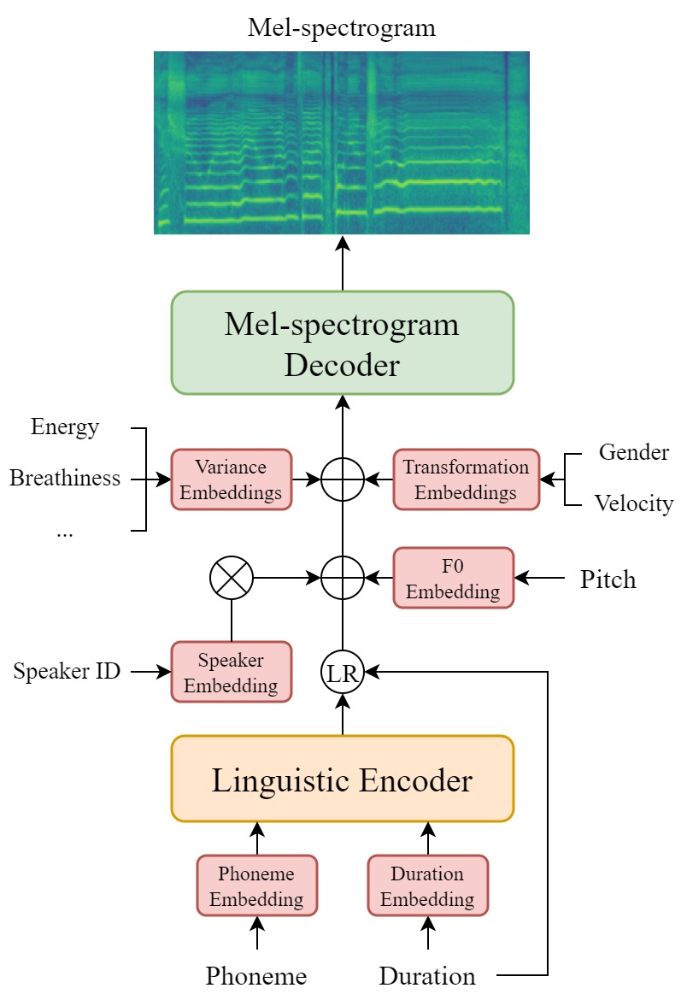

# DiffSinger MAMBA

[](https://arxiv.org/abs/2105.02446)
[](https://github.com/openvpi/DiffSinger/blob/main/LICENSE)

基于 [openvpi/DiffSinger](https://github.com/openvpi/DiffSinger) 的分支，将 Transformer Encoder 替换为 **Mamba3 SSM** + **可选混合 Self-Attention**，并针对 SSM 的训练稳定性和泛化能力进行了改进。

|                                       总览                                        |                                    方差模型                                     |                                    声学模型                                     |
|:-------------------------------------------------------------------------------------:|:-------------------------------------------------------------------------------------:|:-------------------------------------------------------------------------------------:|
|  |  |  |

## 相对上游的主要改动

- **Encoder**：Transformer → MambaEncoder（BiMambaBlock × N），支持混合模式（Mamba3 + Self-Attention 层）
- **学习率调度器**：StepLR → CosineAnnealingLR（SSM 需要平滑衰减，阶梯式下降会导致 loss 尖峰）
- **正则化**：Backbone dropout 0.0→0.1，新增 weight_decay，增大梯度累积步数
- **ONNX 导出**：CHUNK=128 优化的 BiMambaBlock → SimpleSSM 回退方案（无 CUDA 内核依赖）

## 快速开始

### 训练

```bash
# 预处理（仅 CPU，避免多进程 CUDA 冲突）
python scripts/binarize.py --config data/config_acoustic.yaml

# 声学模型训练
python scripts/train.py acoustic --config data/config_acoustic.yaml --exp-name YOUR_EXP_NAME

# 方差模型训练
python scripts/train.py variance --config data/config_variance.yaml --exp-name YOUR_VAR_EXP_NAME
```

## 架构说明

### 混合 Encoder（Mamba3 + Self-Attention）

MambaEncoder 支持通过 `encoder_layer_types` 逐层配置类型：

| 模式 | 配置 | 说明 |
|:---|:---|:---|
| 混合（默认） | `['mamba','mamba','attention','attention']` | 前层：局部 SSM 建模；后层：全局语义聚合 |
| 纯 Mamba | `[]` 或 `null` | 全部使用 BiMambaBlock 层 |

混合模式通过在后层使用 Self-Attention，缓解了 SSM 在低学习率下的不稳定性，Self-Attention 在低 LR 下仍能保持稳定的梯度传播。

### 扩散主干网络

声学模型默认使用 `lynxnet`（基于 CNN，与上游一致）。`mamba`（Mamba3Backbone）可作为替代方案。

## 配置参考

`data/config_acoustic.yaml` 中的关键参数：

| 参数 | 默认值 | 说明 |
|:---|:---|:---|
| `encoder_layer_types` | `['mamba','mamba','attention','attention']` | 逐层类型：`'mamba'` 或 `'attention'` |
| `backbone_type` | `lynxnet` | 扩散主干：`lynxnet` / `wavenet` / `mamba` |
| `lr_scheduler_args` | CosineAnnealingLR(T_max=160k, eta_min=1e-5) | 学习率调度器 |
| `backbone_args.dropout_rate` | 0.1 | 主干 dropout（防过拟合） |
| `optimizer_args.weight_decay` | 1e-5 | L2 权重衰减 |
| `accumulate_grad_batches` | 2 | 梯度累积（平滑噪声） |

## 已知限制

- CUDA mamba-ssm 内核与 ONNX 导出不兼容；推理时使用 SimpleSSM 回退方案
- 混合 Encoder 的检查点与纯 Mamba 的检查点不兼容（层结构不同）
- 方差模型使用 WaveNet 主干（无 SSM），保留原始 StepLR 调度器

## 参考资料

### 原始 DiffSinger
- 论文：[DiffSinger: Singing Voice Synthesis via Shallow Diffusion Mechanism](https://arxiv.org/abs/2105.02446)
- 代码：[openvpi/DiffSinger](https://github.com/openvpi/DiffSinger)

### SSM & Mamba
- [Mamba: Linear-Time Sequence Modeling with Selective State Spaces](https://arxiv.org/abs/2312.00752)
- Mamba3：`mamba-ssm >= 2.3.0`

### 依赖项目
- [OpenUTAU for DiffSinger](https://github.com/xunmengshe/OpenUtau) — 生产部署
- [RMVPE](https://github.com/Dream-High/RMVPE) — 基频提取
- [HiFi-GAN](https://github.com/jik876/hifi-gan) + [NSF](https://github.com/nii-yamagishilab/project-NN-Pytorch-scripts) — 波形重建

## 免责声明

任何组织或个人禁止使用本仓库中的任何功能在未经他人同意的情况下生成其语音，包括但不限于政府领导人、政治人物和名人。如果您不遵守此条款，可能违反版权法。

## 许可证

基于 [Apache 2.0 许可证](LICENSE) 开源。
